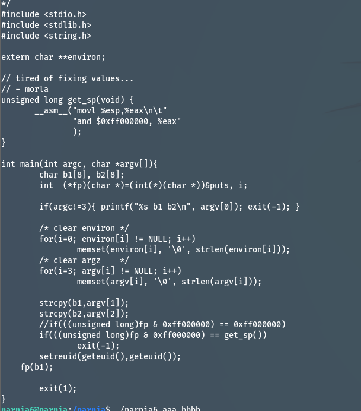
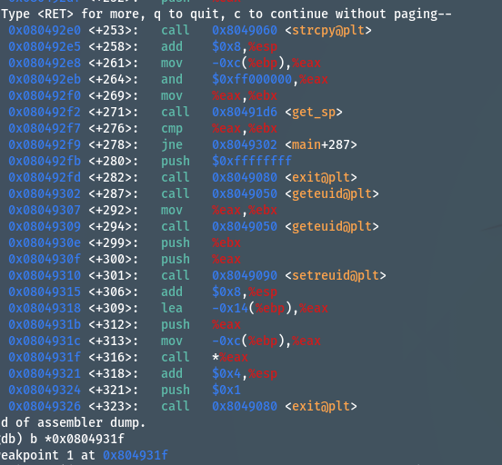
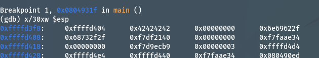
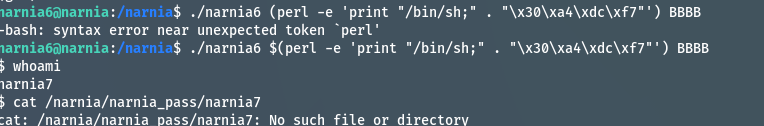

### 解題思路

一定會經過fp(b1), 因此上面的 if 條件判斷一定失敗. 所以一定經過fp(b1) 
我們可以把 fp 改成system 的地址,然後 b1 改成 "/bin//sh".

break 在 call eax

我們發現/bin//sh 接著是後面的地址.因此要用分隔符(;)分開字串符與函數 `/bin/sh;`;

$ cat /etc/narnia_pass/narnia7: 54RtepCEU0
