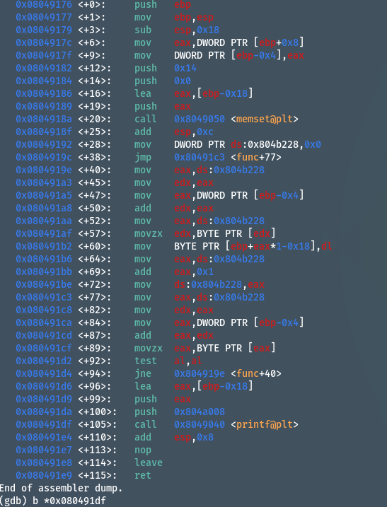

```gdb
set disassembly-flavor intel
b *0x080491df
```


可以看出第一個是blah 的地址，第三個是return address


我們發現 0xffffd650 -> 0xffffd640
blah 的 address 每增加一個byte , 就會減少一個byte


**calculate blah_address**

0xffffd65e - blah_address(4bytes) - junk(4bytes) - ret_addr(4bytes) - shellcode(33bytes) 

blah_address = 0xffffd631
ret_address = blah_address+ fill_bytes(20bytes) + blah_addr(4bytes) + junk(4bytes) + ret_addr(4bytes) = 0xffffd651


whoami: 1FFD4HnU4K